# Лабораторная работа №1
---
## Автор

Ус Владимир, 3МО-1

---
ТЗ: [Документ задания](files/OS_lab1.docx)
---

## Шаги

### 1. Действия с помощью справочной системы:

- 1. Определение текущей даты и установка новой даты:

<a href="files/1.png">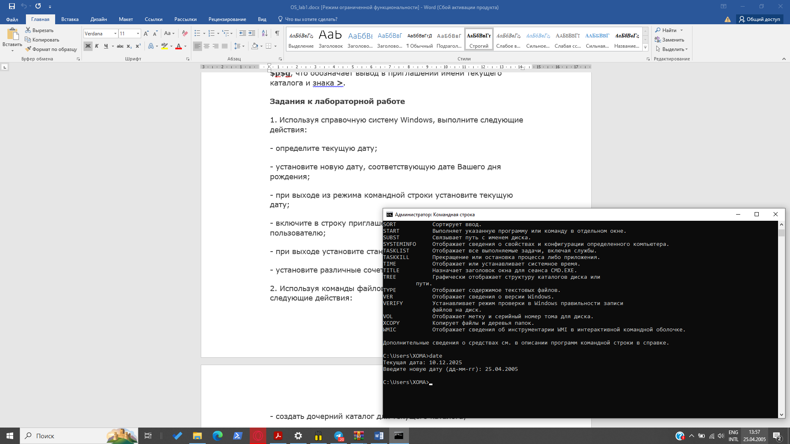</a>

- 2. Возвращение текущей даты и выход:

<a href="files/2.png">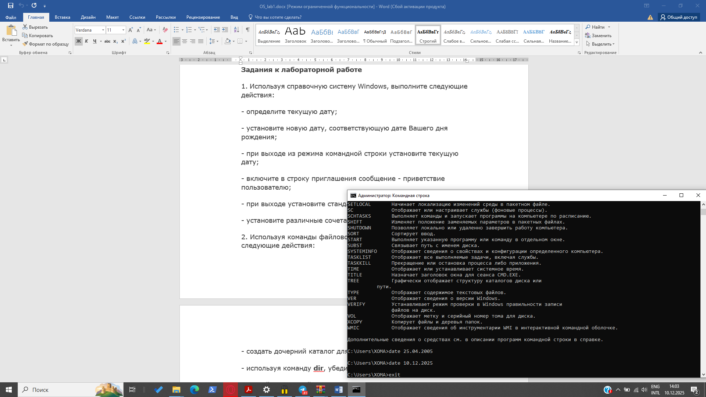</a>

- 3. Включение в строку приглашения сообщение - приветствие пользователю:

<a href="files/3.png">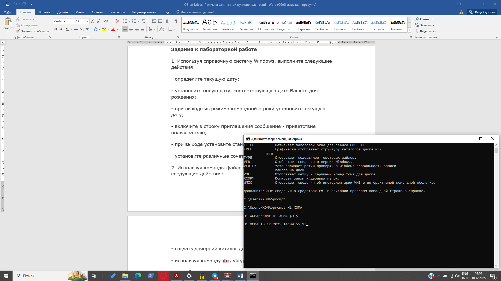</a>

- 4. Установка стандартного вида приглашения и выход:

<a href="files/4.png">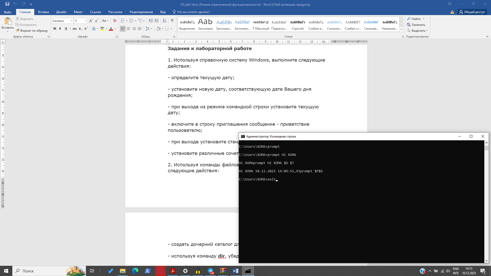</a>

- 5. Установка различных сочетаний цветов текста и фона:

<a href="files/5.png">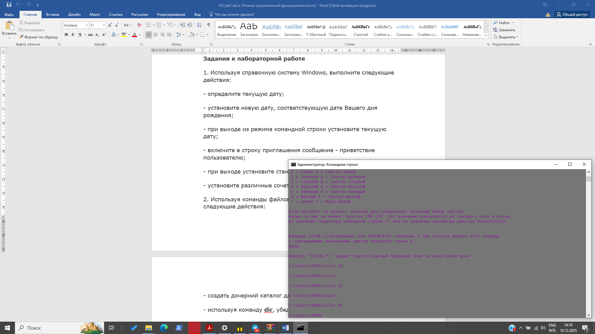</a>

### 2. Действия с файловой системой:

- 1. Создание дочерниего каталога для текущего каталога:

<a href="files/6.png">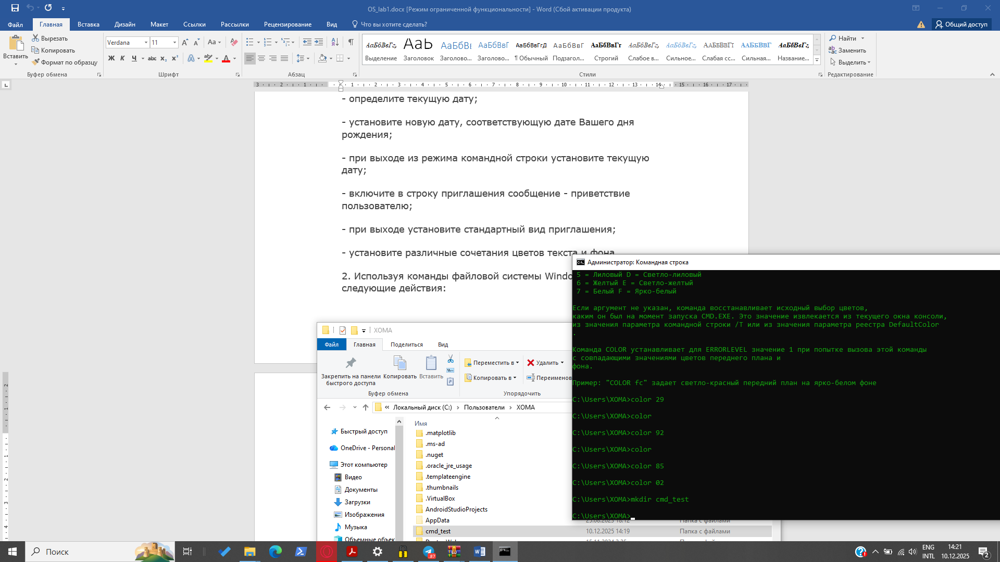</a>

- 2. Убеждаемся в создании подкаталога с помощью dir:

<a href="files/7.png">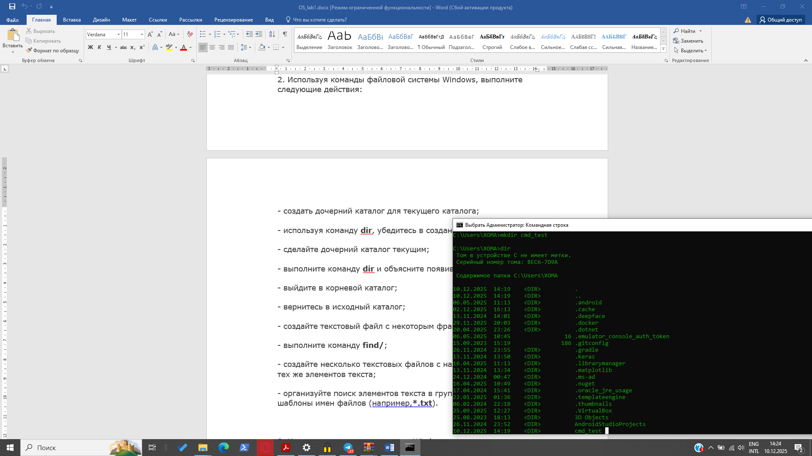</a>

- 3. Делаем дочерний каталог текущим:

<a href="files/8.png">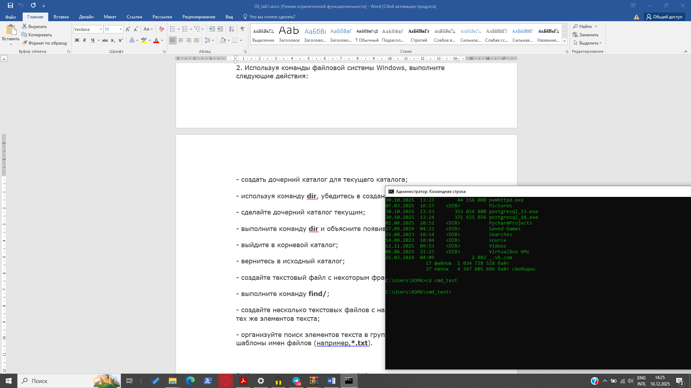</a>

- 4. Выполняем команду dir:

Данные строки обозначают следующее:

1 строка с точкой - специальное обозначение для текущей директории, в которой мы находимся.

2 строка с двумя точками - это специальное обозначение для родительской директории, то есть папки уровнем выше.

Точки служат для навигации, если ввести "cd ." - попадём в ту же директорию, а при вводе "cd .." переместимся выше.

3 строка указывает, что в текущей директории существует 0 файлов и занято 0 байт дискового пространства.

4 строка указывает, что в текущей директории имеются в нашем случае 2 ссылки (те самые "." и ".."), а также общее количество свободного дискового пространства ПК.

- 5. Выходим в корневой каталог:

<a href="files/10.png">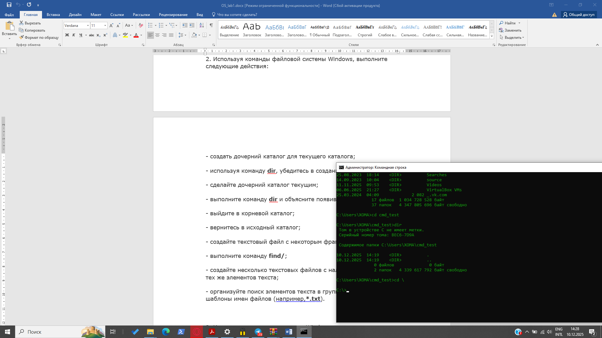</a>

- 6. Возвращаемся в исходный каталог:

- 7. Создаём текстовый файл с некоторым фрагментом текста:

<a href="files/12.png">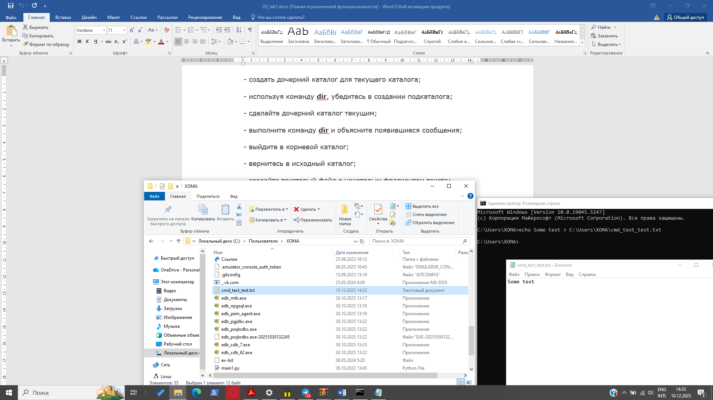</a>

- 8. Выполняем команду "find/":

<a href="files/13.png">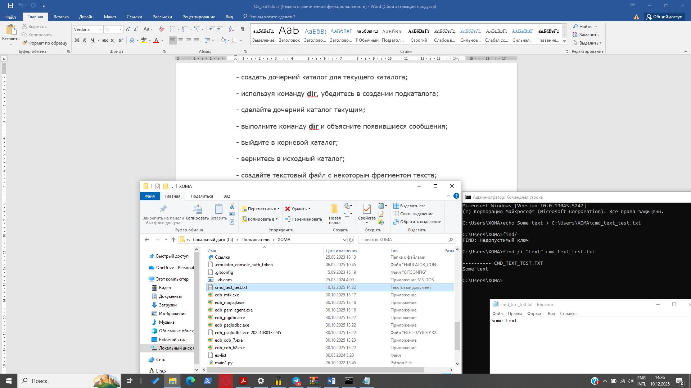</a>

- 9. Создаём несколько текстовых файлов с наличием в них одних и тех же элементов текста:

<a href="files/14.png">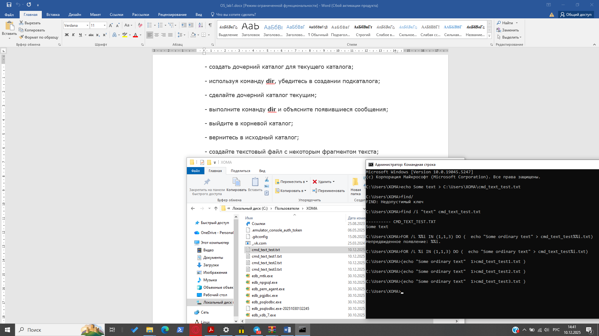</a>

- 10. Организуем поиск элементов текста в группе файлов, используя шаблон имен файлов "*.txt":

<a href="files/16.png">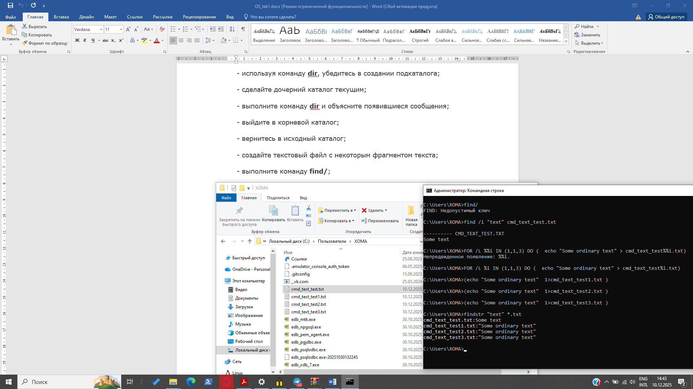</a>

### 3. Действия с командой attrib:

- 1. Изучаем функциональные возможности команды "attrib":

- 2. Устанавливаем для одного из файлов, созданных в п.2, поочередно атрибуты - скрытый, системный (требует предварительного выключения архивного), архивный (установлен по умолчанию). Убеждаемся, что атрибуты были приняты системой:

<a href="files/18.png">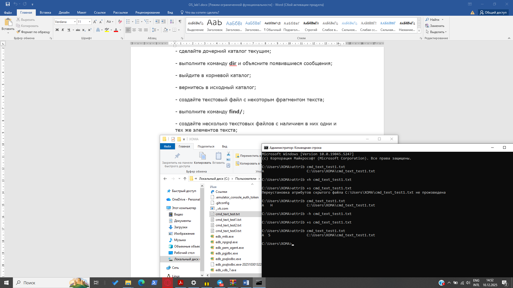</a>
