# Лабораторная работа №2
---
## Автор


Ус Владимир, 3МО-1

---
ТЗ: [Документ задания](files/OS_lab2.docx)
---

## Шаги

1. В командной строке набираем и выполняем команду ```echo off```:

<a href="files/1.png">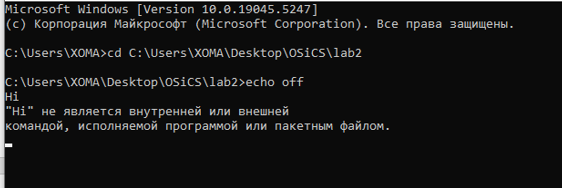</a>

2. Выполняем команду ```dir```:

<a href="files/2.png">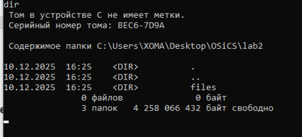</a>

3. Восстанавливаем приглашение с помощью команды ```echo on```:

<a href="files/3.png">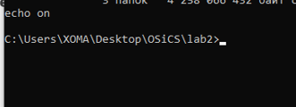</a>

4. Создаём текстовый файл ```t1.bat``` с определённым содержанием:

<a href="files/4.png">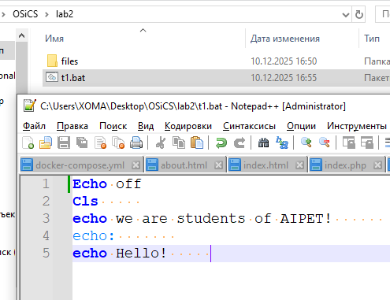</a>

- 1. Выполняем его, вызвав ```t1.bat```:
 
<a href="files/5.png">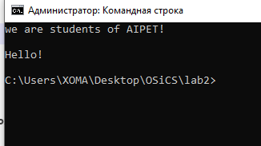</a>

Объяснение результата:

Мы вывели строки в командную строку с помощью ```echo```.

- 2. Снова заменяем команду ```echo off``` на ```echo on```. Снова вызываем файл ```t1.bat```:

<a href="files/6.png">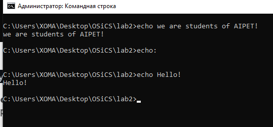</a>

Объяснение результата:

Разрешили выводить команды перед их выполнением.

5. Создаём командный файл ```t2.bat``` с определённым содержанием:

<a href="files/7.png">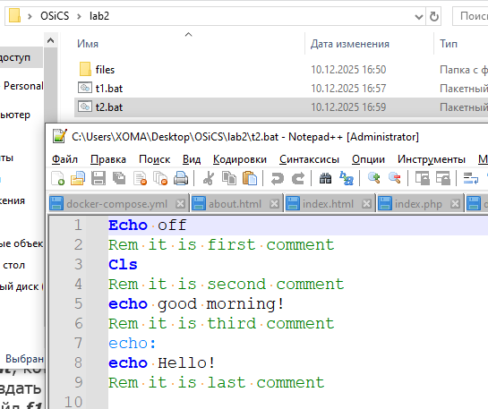</a>

- 1. Выполняем файл:
 
<a href="files/8.png">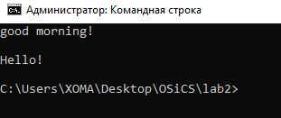</a>

- 2. Заменяем ```echo off``` на ```echo on``` и снова выполняем файл:
 
<a href="files/9.png">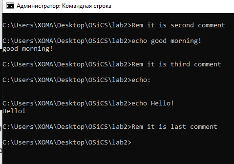</a>

- 3. Сравним результаты. Объяснение результата:

Разрешив выводить команды перед их выполнением, мы видим все комментарии.

6. Создадим командный файл ```f1.bat```, который выводит содержимое некоторого текстового файла. Создадим командный файл ```f2.bat```, который вызывает командный файл ```f1.bat```. Используя ```echo```, выведем файлы в разных режимах. Используя ```@```, сделаем так, чтобы команды пакетного файла не выводились:

<a href="files/10.png">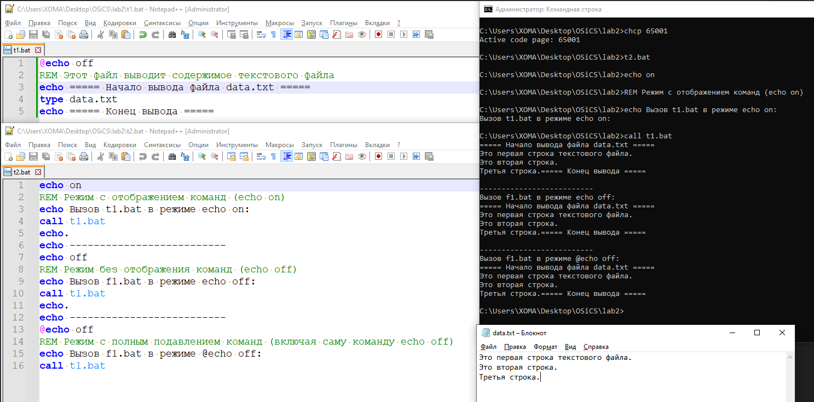</a>

7. Создадим командный файл, который после вывода некоторых сообщений делет паузу, а затем выводит следующую фразу:

<a href="files/11.png">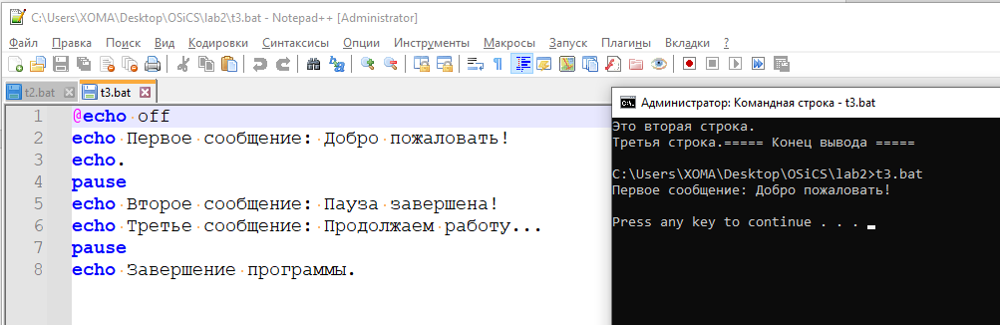</a>

8. Создадим командный файл, который можно прервать, когда необходимо:

<a href="files/12.png">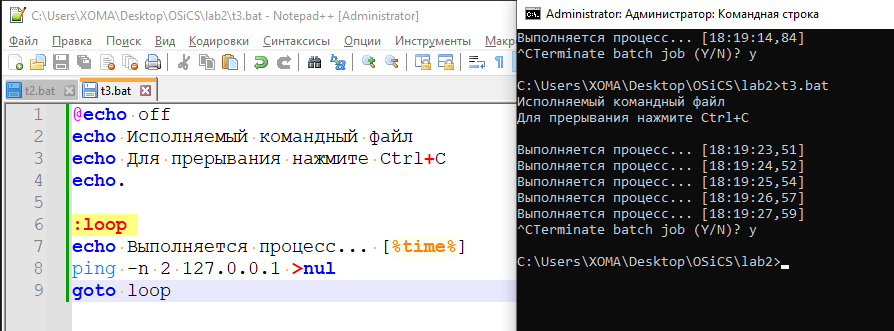</a>

9. Создадим переменную окружения, которая находит остаток от деления двух целых чисел, найдём целую часть от деления двух целых чисел:

<a href="files/13.png">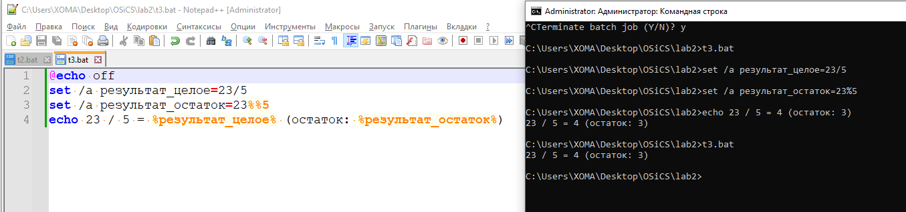</a>

10. Создадим переменную окружения, которая имеет значение ```aipet```:

<a href="files/14.png">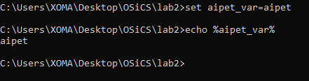</a>

11. Создадим командный файл, который в случае совпадения двух строковых переменных присвоит целой переменной значение 2, в противном случае выводит строку – ```no equal```:

<a href="files/15.png">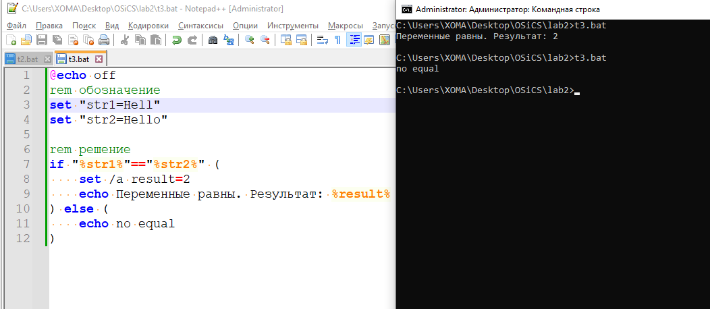</a>

12. Создадим командный файл, который проверяет, есть ли в текущем каталоге заданный файл (формальные параметры):

<a href="files/16.png">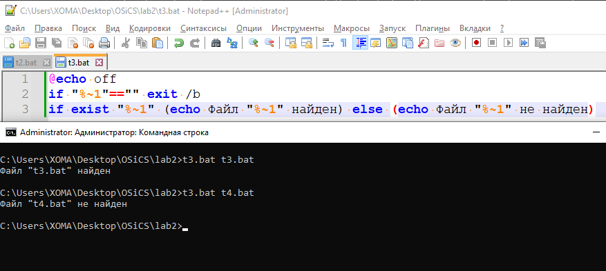</a>

13. Создаём каталог. В созданном каталоге сформируем несколько текстовых файлов с разным содержанием. В режиме командной строки выполним команду вывода на экран содержимого этих файлов. Создадим командный файл для вывода файлов на экран:

<a href="files/17.png">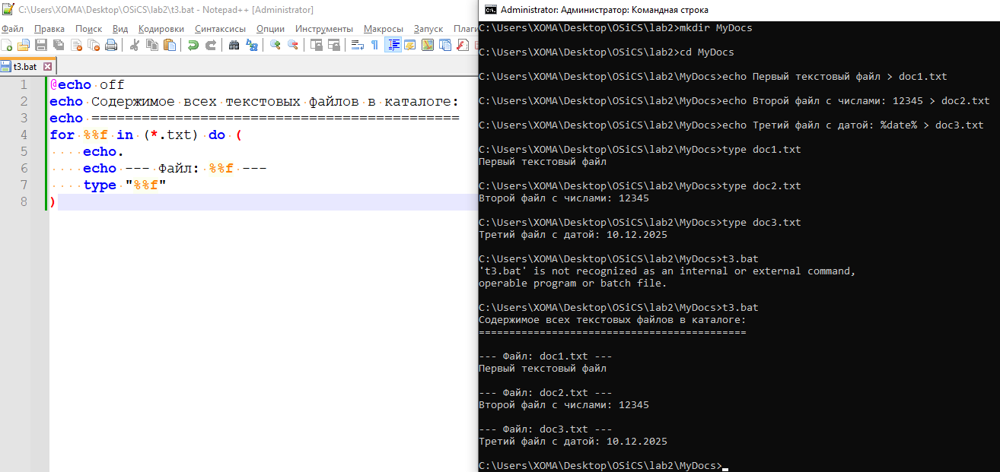</a>
