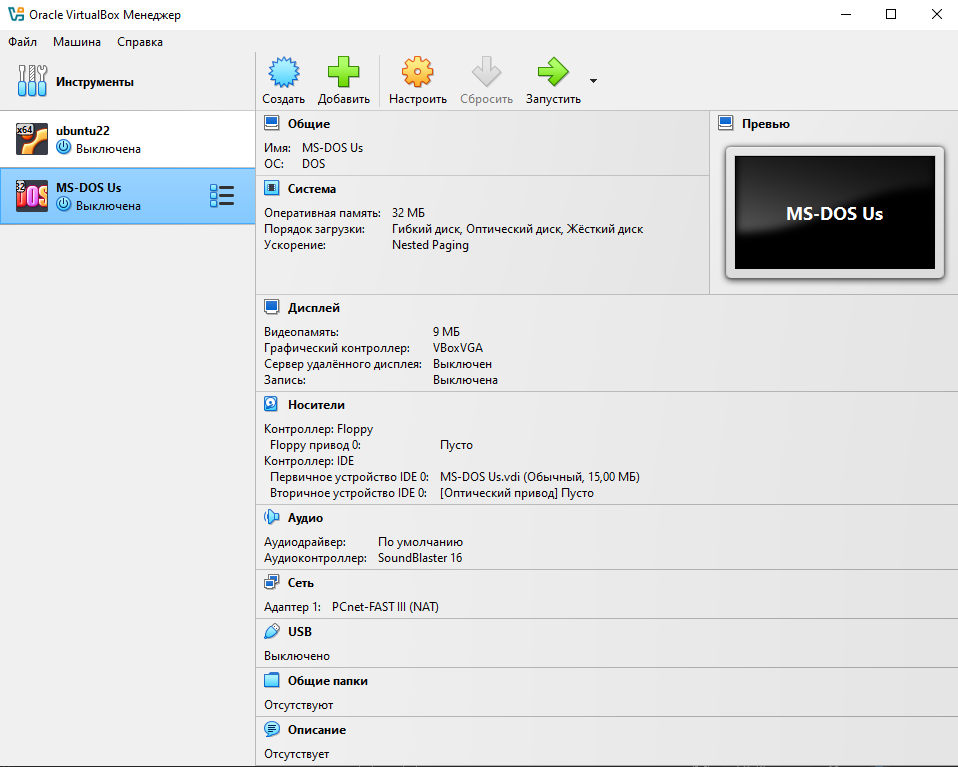
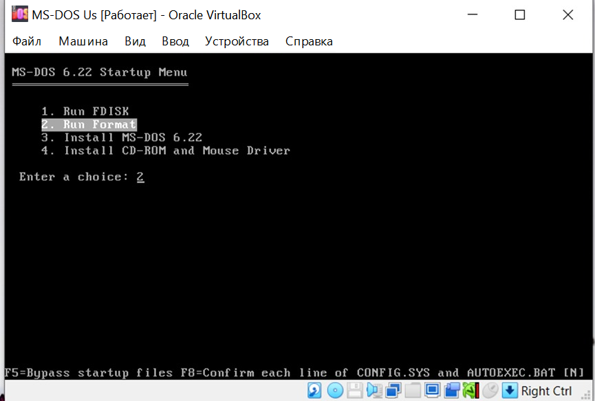
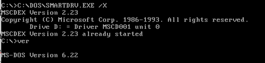
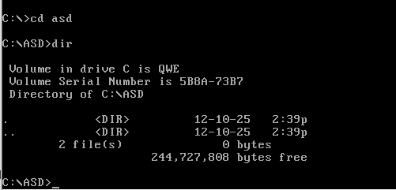
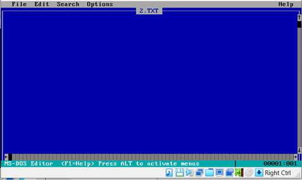
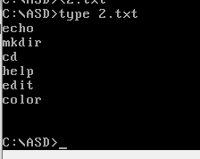
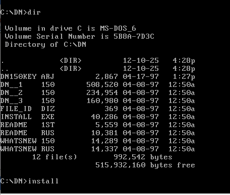

# Лабораторная работа №2
---
## Автор


Ус Владимир, 3МО-1

---
ТЗ: [Документ задания](files/OS_lab3.docx)
---

## Шаги

1. Создать виртуальную машину в программе ```VirtualBox``` (имя машины должно иметь следующий формат: MS-DOS Фамилия)              

2. Создать новый  виртуальный жесткий диск фиксированного размера не менее 10 Мб      

3. Войти в настройки созданной виртуальной машины, выбрать в качестве контроллера Flopy образ первой дискеты.   

4. Загляните в раздел Система и убедитесь, что на вкладке Материнская плата в порядке загрузки первой стоит дискета (если это не так вы с легкостью можете изменить порядок при помощи кнопок со стрелочками):    

<a href="screenshots/1.png"></a>

5. Установка MS-DOS.            

6. Сделать скриншот виртуальной машины для отчета:

<a href="screenshots/2.png"></a>
<a href="screenshots/3.png"></a>   

7. Запустить виртуальную машину с установленной ОС MS-DOS. Очистить экран монитора. Запросить версию OS:

<a href="screenshots/5.png"></a>  

8. Создать новый каталог OS. Перейти в новый созданный каталог:

<a href="screenshots/4.png"></a> 

9. Создать в нем (с помощью команды ```EDIT```) файл ```2.txt```:

<a href="screenshots/6.png"></a>  

10. Файл ```2.txt``` должен содержать все известные вам команды ms-dos (по одной на каждой строке). Сохранить созданный файл. Просмотреть созданный файл:

<a href="screenshots/7.png"></a>

11. Найти в сети Интернет и установить один из консольных файловых менеджеров - NortonCommander или DosNavigator:

<a href="screenshots/8.png"></a>
<a href="screenshots/9.png"></a>

12.	Перейти в корневой каталог:

<a href="screenshots/10.png"></a>
