# Лабораторная работа №4
---
## Автор


Ус Владимир, 3МО-1

---
ТЗ: [Документ задания](files/OS_lab4.docx)
---

## Шаги
1. Исполните из командной строки ```Help Get-Command```:

<a href="screenshots/1.png">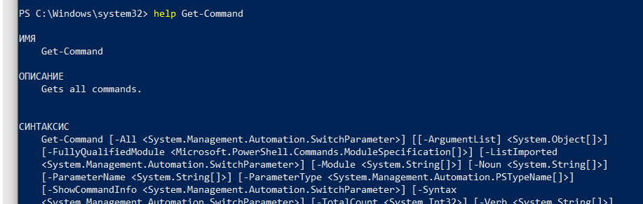</a>  

2. Выполните команду ```Get-Command```:

<a href="screenshots/2.png">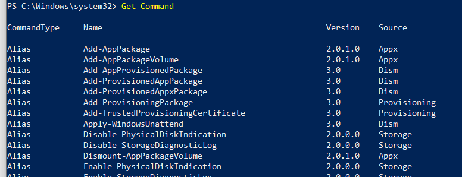</a>      

3. Просмотрите список всех сервисов, запущенных на вашем компьютере, исполнив команду ```Get-Service```:

<a href="screenshots/3.png">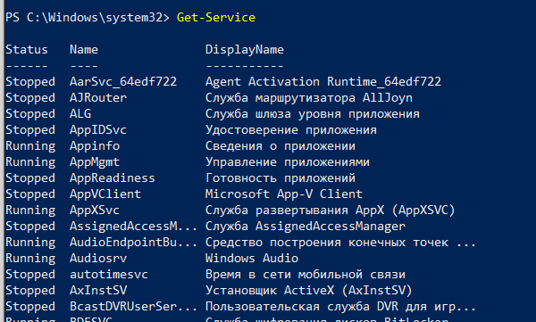</a>   

4. Просмотрите список всех процессов, запущенных в настоящий момент на вашем компьютере,исполнив команду ```Get-Process```:

<a href="screenshots/4.png">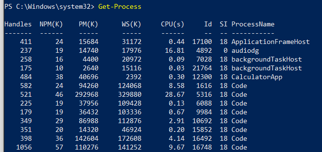</a> 

5. Выполните команду ```Get-Process explorer```:

<a href="screenshots/5.png">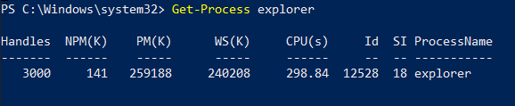</a>  

6. Из командной строки исполните команду ```Get-Process w*```:

<a href="screenshots/6.png">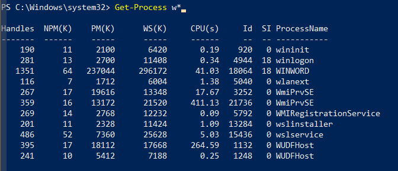</a>  

7. Исполните команду ```Get-Process i* | format-list```:

<a href="screenshots/7.png">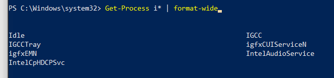</a>

8. Для получения подробной информации о различных форматах можно использовать следующую команду ```Help format*```:

<a href="screenshots/8.png">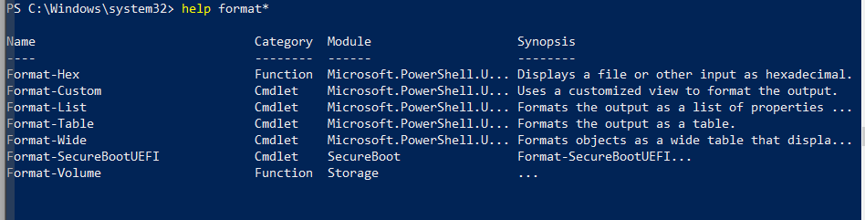</a>

9. Просмотрите все свойства объекта, полученного при выполнении команды Get-Process, используя следующую команду ```Get-Process | Get-Member```:

<a href="screenshots/9.png">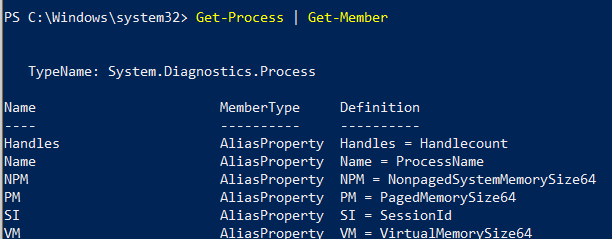</a>

10. Выполните операцию фильтрации, исполнив команду ```Get-Process | where {$_.handlecount -gt 400}```:

<a href="screenshots/10.png">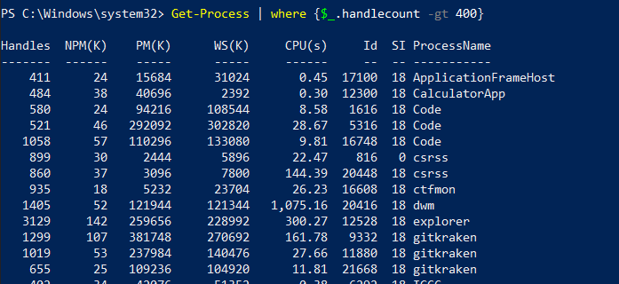</a>

11. Выполните операцию сортировки, исполнив команду ```Get-Process | where {$_.handlecount -gt 400} | sort-object Handles```:

<a href="screenshots/11.png">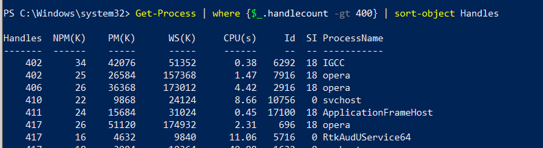</a>

12. Произведем сортировку объектов по свойству WS (workingset) и выбор 5 процессов, занимающих больше всего памяти ```Get-Process | sort-object -property WS –descending| select-object -first 5```:

<a href="screenshots/12.png">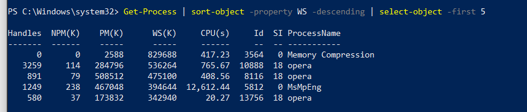</a>

13. Запустите Notepad. Выполнитекоманду ```Get-process notepad | stop-process```:

<a href="screenshots/13.png">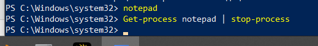</a>

14. ```Get-Process notepad | stop-process -whatif```:

<a href="screenshots/14.png">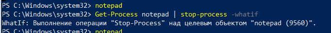</a>

15. ```Get-Process notepad | stop-process -confirm```:

<a href="screenshots/15.png">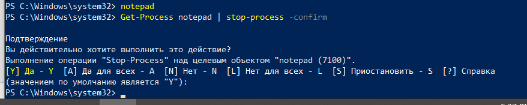</a>

16.	Создадим новый подкаталог TextFiles в текущем каталоге ```new-itemTextFiles -itemtype directory```:

<a href="screenshots/16.png">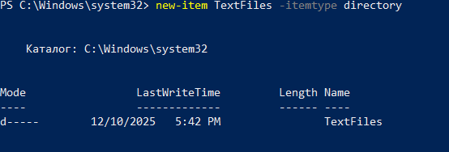</a>

17. Создайте несколько новых файлов в текущем каталоге: ```psdemo.txt```, ```1.txt```, ```2.txt```:

<a href="screenshots/17.png">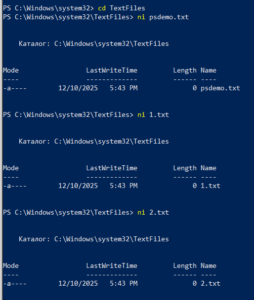</a>

18.	Скопируем все файлы с расширением ```*.txt``` в подкаталог ```TextFiles```, используя команду ```copy-item```:

<a href="screenshots/18.png">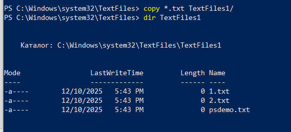</a>

19.	С помощью команды ```rename-item``` переименовываем файл ```psdemo.txt``` в ```psdemo.bak```. При необходимости можно применять опции ```-path``` и ```-newName``` ```rename-item psdemo.txt psdemo.bak```:

<a href="screenshots/19.png">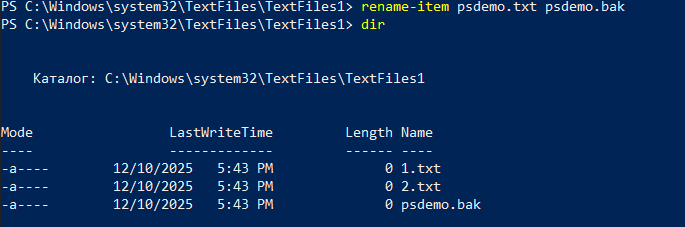</a>

20.	После того как файл переименован, переносим его на один уровень вверх, используя команду ```move-item``` ```move-itempsdemo.bak ..\```:

<a href="screenshots/20.png">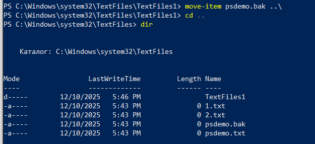</a>

21.	Манипуляции с файловой системой мы завершаем удалением всего каталога ```TextFiles```, используя команду ```remove-item```. Поскольку в каталоге ```TextFiles``` содержатся файлы, применяется опция ```-recurse``` ```remove-itemTextFiles–recurse```:

<a href="screenshots/21.png">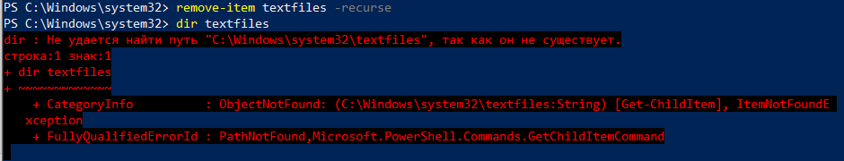</a>
