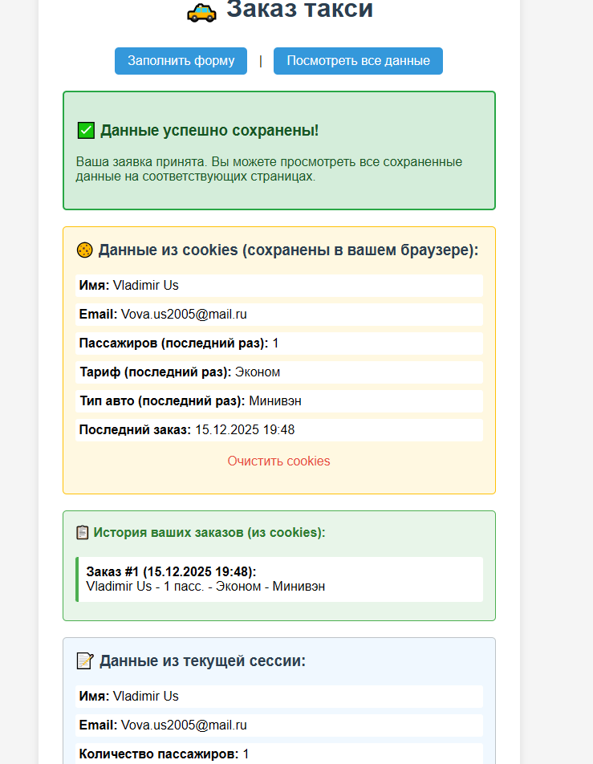
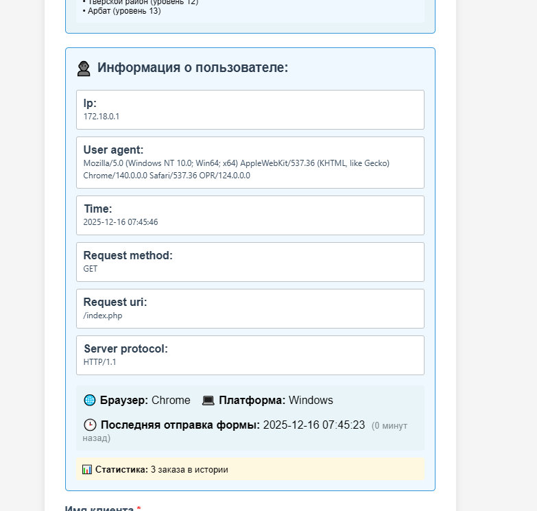
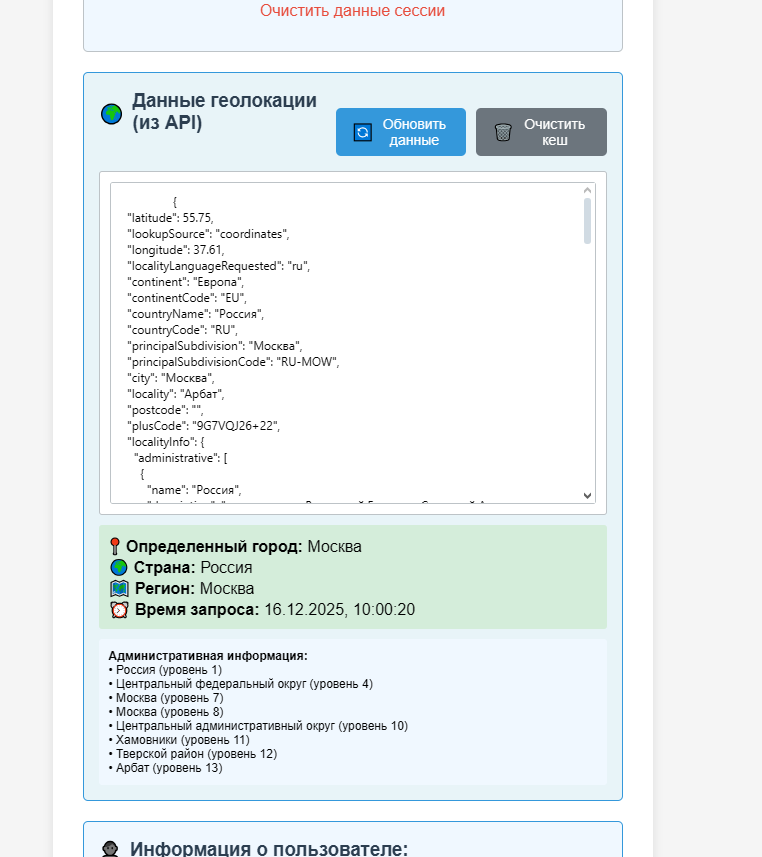
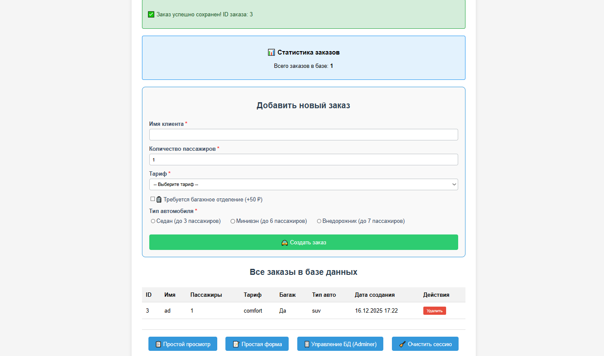
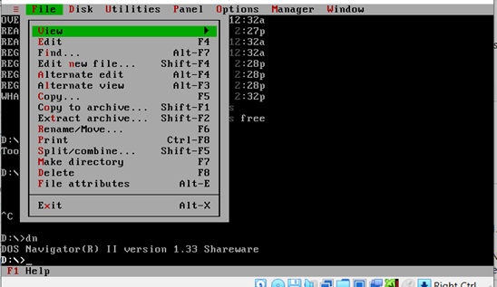
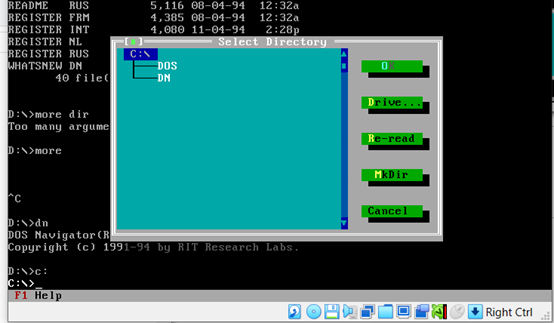
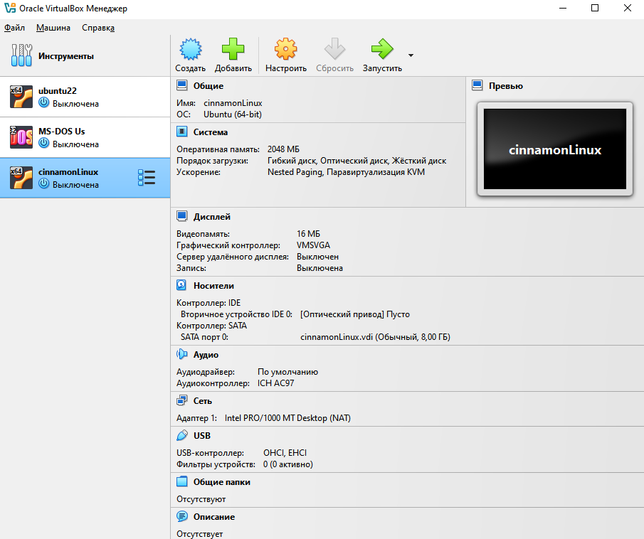
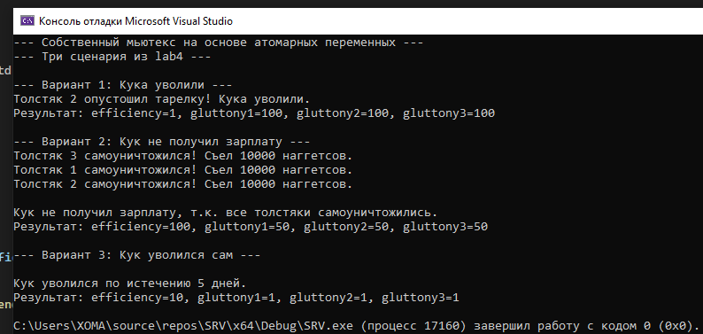
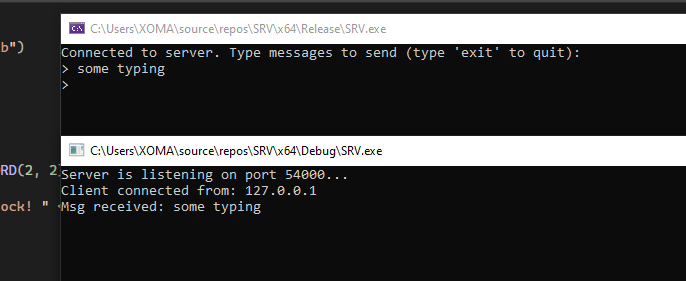

# projects-2025-2
### University works (sem 5)
---
## Лабораторные по предметам:

## WEB
[WEB-программирование (HTML, Docker, Nginx)](WEB)

<table><tr>
<td></td>
<td></td>
<td></td>
<td></td>
</tr></table>

## OSiCS
[Операционные системы и компьютерные сети (cmd, dos)](OSiCS)

<table><tr>
<td></td>
<td></td>
<td></td>
</tr></table>

## RTS
[Системы реального времени (C++)](RTS)

<table><tr>
<td></td>
<td></td>
</tr></table>
