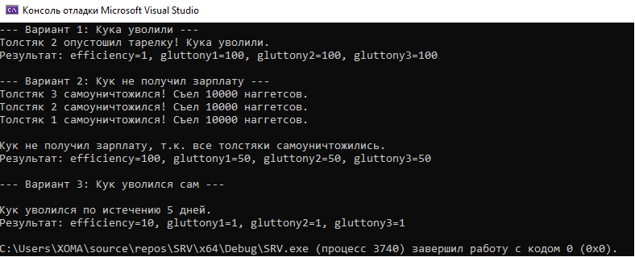
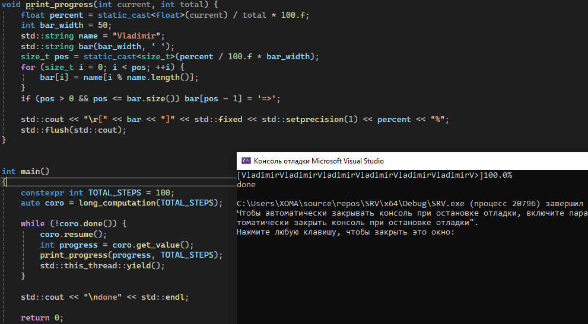

# Лабораторные по системам реального времени
---
## Автор

Ус Владимир, 3МО-1

---

### Список

[Лабораторная №1](lab1/lab1.cpp):

[Задание](labs%20info/L1.docx)

Задание простое, объяснения не будет

---
[Лабораторная №2](lab2/lab2.cpp):

[Задание](labs%20info/L2.docx)

Задание простое, объяснения не будет

---
[Лабораторная №3](lab3/lab3.cpp):

[Задание](labs%20info/L3.docx)

Задание простое, объяснения не будет

---
[Лабораторная №4](lab4/lab4.cpp):

[Задание](labs%20info/L4.docx)

Кратко: с помощью mutex в несколько потоков симулировать работу повара, кормящего 3-х толстяков наггетсами. Создать 3 исхода: 
-	Кук уволен (за отставание)
-	Кук остался без зарплаты (толстяки лопнули)
-	Кук уволился сам (после 5 дней = 5 секунд работы)

---
[Лабораторная №5](lab5/lab5.cpp):

[Задание](labs%20info/L5.docx)

Кратко: Реализовать собственный мьютекс на основе атомарных переменных и методе compare_exchange, lock и unlock обязательны. На примере лабораторной 4.

---
[Лабораторная №6](lab6/lab6.cpp):

[Задание](labs%20info/L6.docx)

Кратко: Реализация прогрессбара с именем

---
Лабораторная №7 [сервер](lab7/lab7.1.cpp) + [клиент](RTS/lab7/lab7.2.cpp):

[Задание](labs%20info/L7.docx)

Кратко: Написать сервер и клиент с отправкой и принятием сообщений

