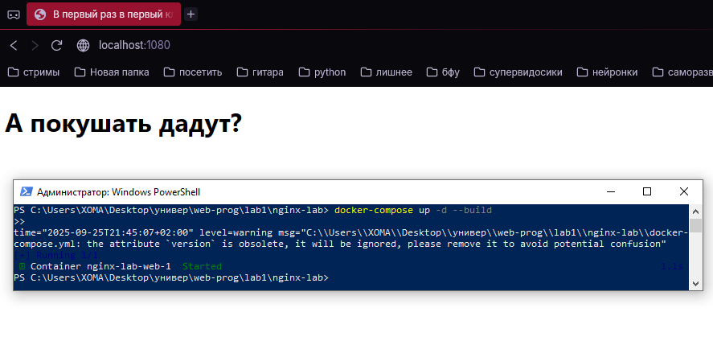
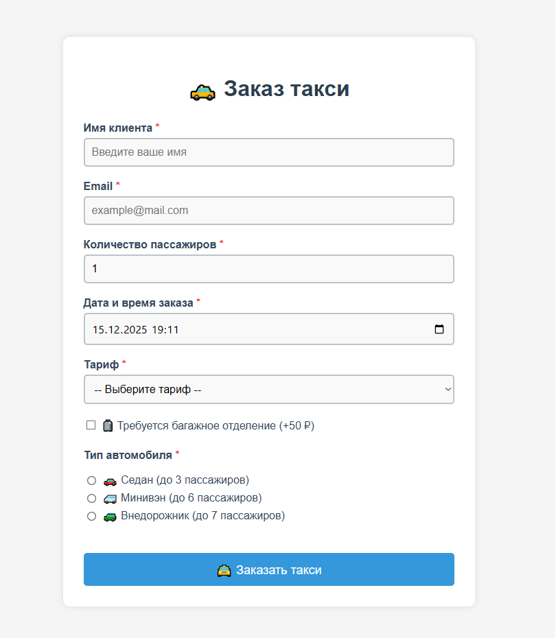

# Лабораторные работы по WEB-программированию
---
## Автор

Ус Владимир, 3МО-1

---
ТЗ: https://docs.google.com/document/d/1CjnI92sMiuCZ2yHSoxwI__8Br11fWy7yEdG7PcxRWyY/edit?tab=t.0
---

### Список

[Лабораторная №1](https://github.com/VAUsIGT/projects-2025-2/new/main/WEB/lab1):

---
[Лабораторная №2](https://github.com/VAUsIGT/projects-2025-2/new/main/WEB/lab2):

---
[Лабораторная №3](https://github.com/VAUsIGT/projects-2025-2/new/main/WEB/lab3):

---
[Лабораторная №4](https://github.com/VAUsIGT/projects-2025-2/new/main/WEB/lab4):

<table><tr>
<td></td>
<td></td>
</tr></table>
