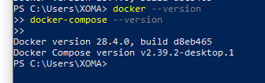
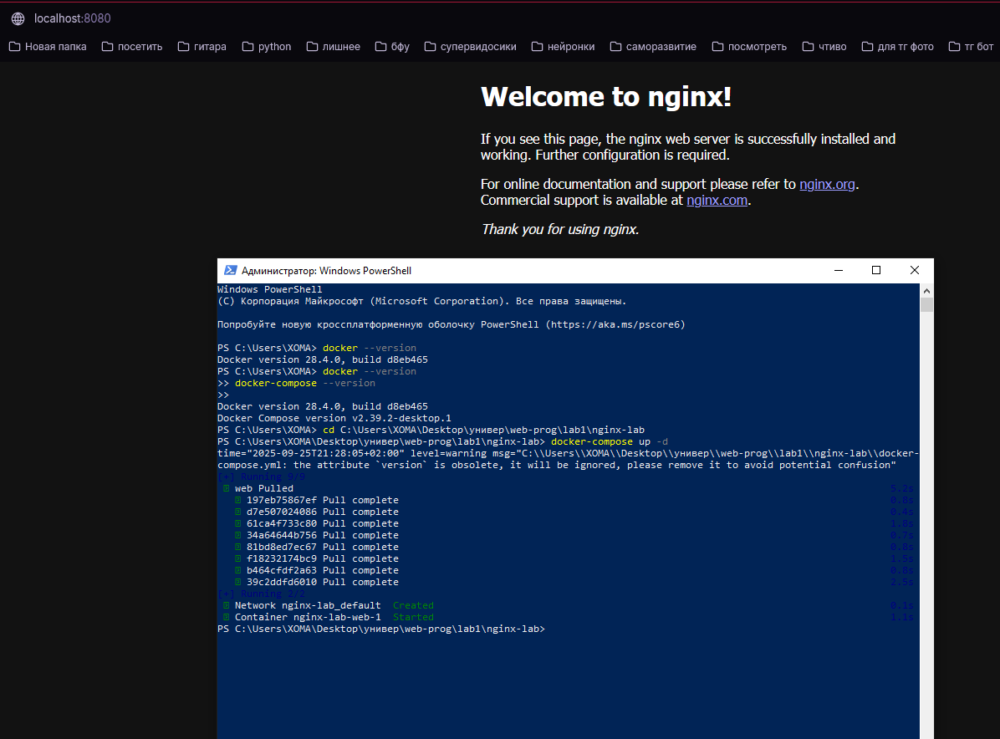
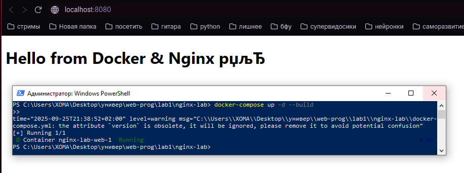
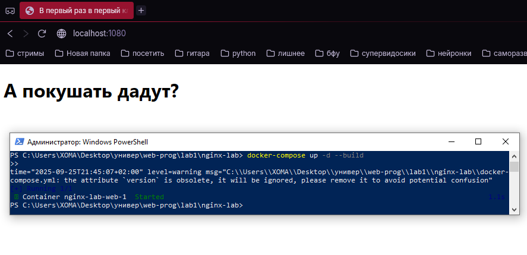

# Лабораторная работа №1: Nginx + Docker
---
## Автор


Ус Владимир, 3МО-1

---
ТЗ: https://docs.google.com/document/d/1CjnI92sMiuCZ2yHSoxwI__8Br11fWy7yEdG7PcxRWyY/edit?tab=t.0
- Кратко: Создать веб-сервер в Docker с использованием Nginx и подключить HTML-страницу
---

### Шаги


1. Установка Docker:

<a href="screenshots/1.PNG"></a>

2. Первый запуск Nginx

<a href="screenshots/2.PNG"></a>

3. Создание пробного сайта:

<a href="screenshots/3.PNG"></a>

4. Персонализация сайта:

<a href="screenshots/4.PNG"></a>

- Добавление страницы с био:

<a href="screenshots/5.PNG"></a>

---
## Как запустить:

1. Клонировать репозиторий:
   ```bash
   git clone https://github.com/VAUsIGT/projects-2025-2/tree/main/WEB/lab1
   cd nginx-lab
2. Запустить контейнеры:
```bash
docker-compose up -d --build
```
3. Открыть в браузере:
```http://localhost:1080```
## Содержимое проекта

```docker-compose.yml``` — описание сервиса Nginx

```code/index.html``` — главная HTML-страница

```screenshots/``` — все скриншоты

---
## Итоги:
Docker запущен, Nginx отдаёт HTML-страницу.
