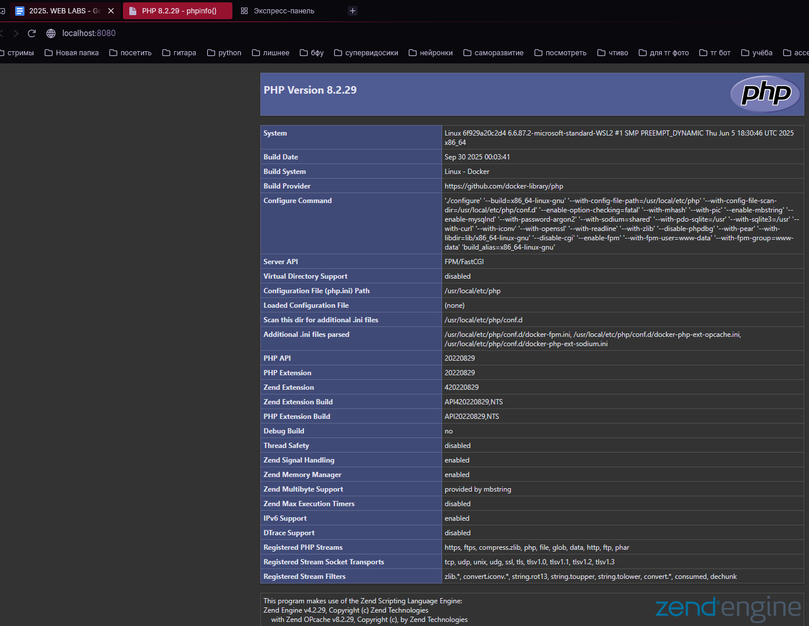

# Лабораторная работа №2: Nginx + PHP-FPM + HTML-формы
---
## Автор

Ус Владимир, 3МО-1

---
ТЗ: https://docs.google.com/document/d/1CjnI92sMiuCZ2yHSoxwI__8Br11fWy7yEdG7PcxRWyY/edit?tab=t.0
- Кратко: Настроить веб-сервер Nginx для работы с PHP через PHP-FPM в Docker. Создать HTML-форму с обработкой на JavaScript без перезагрузки страницы.
---

### Цели работы
---
- Настроить Nginx для обработки PHP-файлов через PHP-FPM
- Создать интерактивную HTML-форму для записи на экскурсию
- Реализовать обработку формы на JavaScript
- Освоить работу с Docker Compose и несколькими контейнерами

### Итог
---
1.Проверка PHP

2. Форма заказа такси

### Как запустить проект
---
1. Клонировать репозиторий:
- `git clone https://github.com/VAUsIGT/projects-2025-2/tree/main/WEB/lab2`
- `cd nginx-lab`
2. Запустить контейнеры:
- `docker-compose up -d --build`
3. Открыть в браузере:
- Главная страница: `http://localhost:8080/index.php` 
- Проверка PHP: `http://localhost:8080`
- Форма экскурсии: `http://localhost:8080/form.html`
