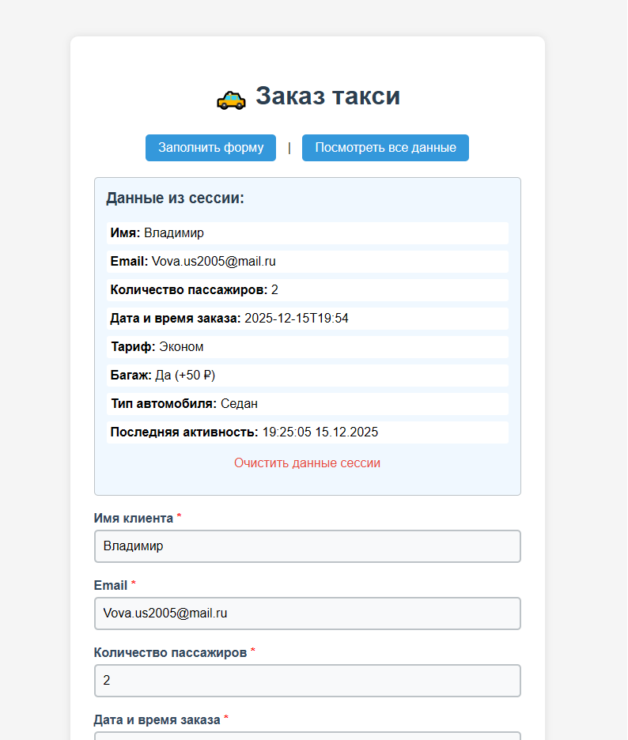
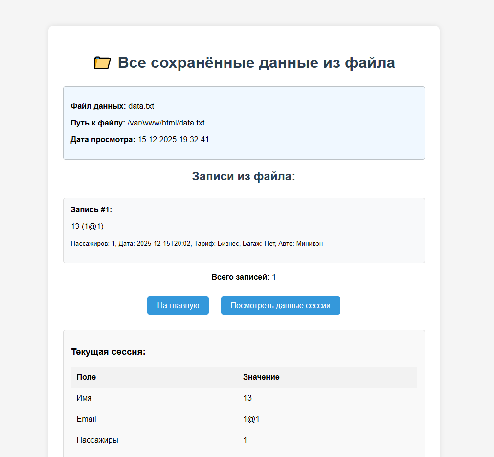

# Лабораторная работа №3: Обработка форм на PHP + Сессии + Файловое хранилище
---
## Автор

Ус Владимир, 3МО-1

---
ТЗ: https://docs.google.com/document/d/1CjnI92sMiuCZ2yHSoxwI__8Br11fWy7yEdG7PcxRWyY/edit?tab=t.0
- Кратко: Преобразовать проект из ЛР-2 для обработки данных формы на стороне сервера с помощью PHP. Реализовать сохранение данных в сессии и файловое хранилище.
---

### Цели работы
---
- Научиться обрабатывать данные формы на стороне сервера с помощью PHP.
- Сохранять данные формы в сессии.
- Сохранять данные в файл и выводить их обратно на странице.
- Научиться выводить все сохранённые данные в отдельной странице.
- Научиться изменять существующую форму, чтобы отключить JS-обработку (кроме alert) и использовать PHP.

### Итог
---
1. Добавили просмотр введённых данных на странице `index.php`

2. Добавили чтение данных из txt файла на странице `view.php`

3. Добавили чтение данных из cookie

### Как запустить проект
---
1. Клонировать репозиторий:
- `git clone https://github.com/VAUsIGT/projects-2025-2/tree/main/WEB/lab3`
- `cd nginx-lab`
2. Запустить контейнеры:
- `docker-compose up -d --build`
3. Открыть в браузере:
- Форма экскурсии: `http://localhost:8080/form.html`
- Главная страница c cookie и чтением данных из txt файла: `http://localhost:8080/index.php` 
