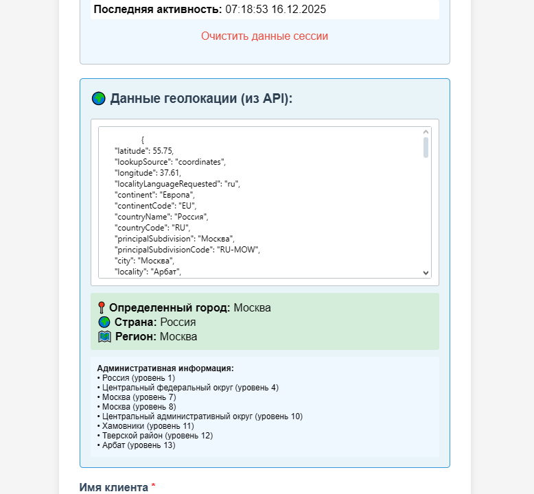

# Лабораторная работа №4: Composer, классы и работа с публичным API
---
## Автор

Ус Владимир, 3МО-1

---
ТЗ: https://docs.google.com/document/d/1CjnI92sMiuCZ2yHSoxwI__8Br11fWy7yEdG7PcxRWyY/edit?tab=t.0
- Кратко: Интегрировать внешние библиотеки через Composer и подключить публичный API к проекту. Реализовать работу с классами, куками и пользовательской информацией.
---

### Цели работы
---
- Освоить работу с Composer и структурой vendor
- Научиться работать с классами и внешними библиотеками
- Интегрировать публичный API без регистрации
- Реализовать работу с куками и пользовательской информацией
- Организовать вывод данных из API на страницы проекта

### Итог
---
1. демо `демо`

