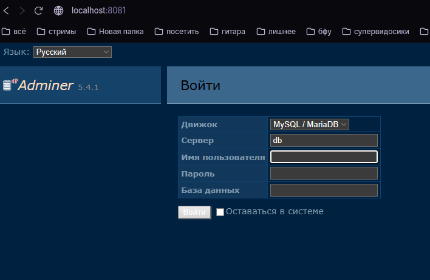
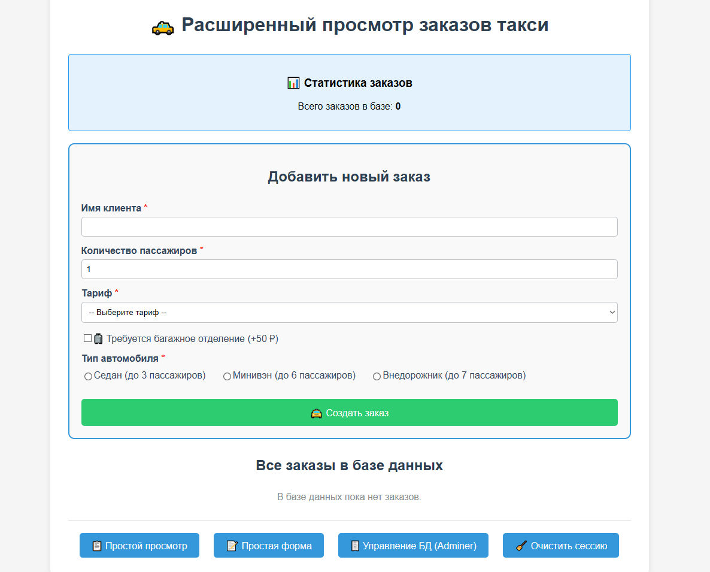

# Лабораторная работа №5: Интеграция с базой данных MySQL
---
## Автор

Ус Владимир, 3МО-1

---
ТЗ: https://docs.google.com/document/d/1CjnI92sMiuCZ2yHSoxwI__8Br11fWy7yEdG7PcxRWyY/edit?tab=t.0
- Кратко: Интегрировать базу данных MySQL в существующий проект. Реализовать сохранение данных формы в базу данных и отображение всех записей на главной странице.
---

### Цели работы
---
- Настроить MySQL в Docker-контейнере
- Создать структуру базы данных и таблицу для хранения записей
- Реализовать сохранение данных формы в БД
- Организовать чтение и отображение данных из БД на главной странице
- Реализовать преобразование технических значений в читаемый формат

### Итог
---
1. Оставили от прошлой лабораторной минимум:

---
2. Создали Adminer порт `8081`:

---
3. Полная реализация ТЗ:

---
4. Бонус:

