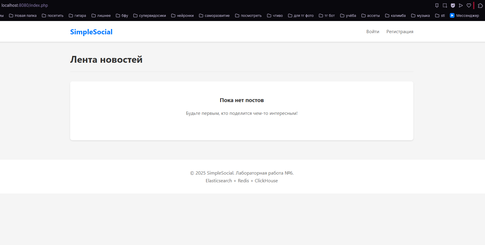
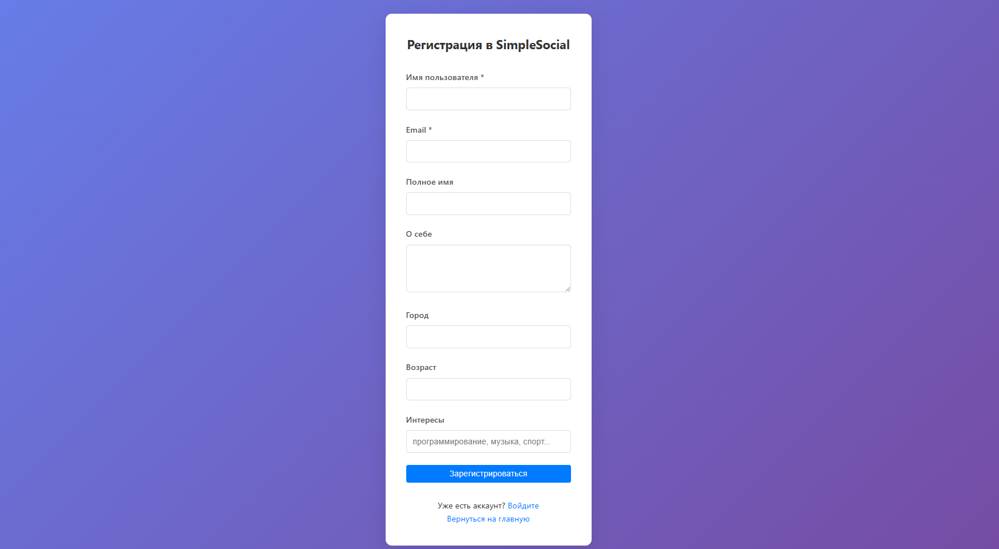
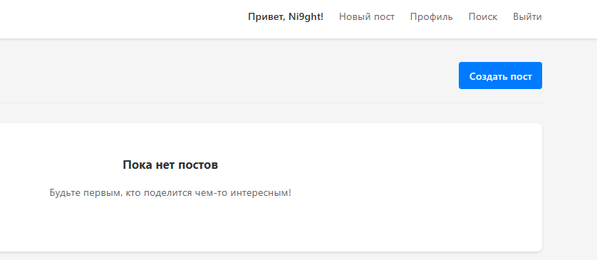
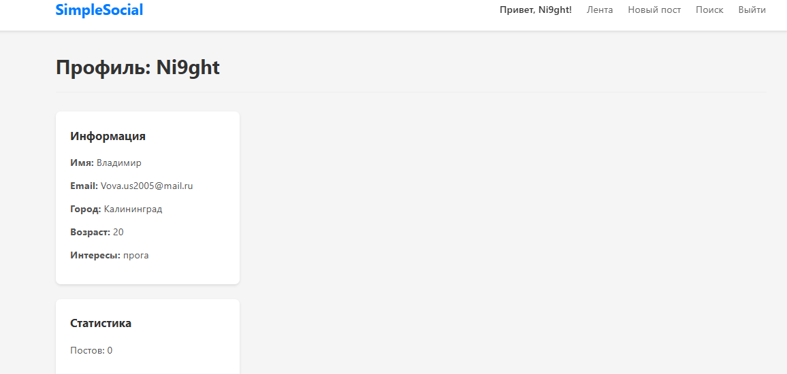
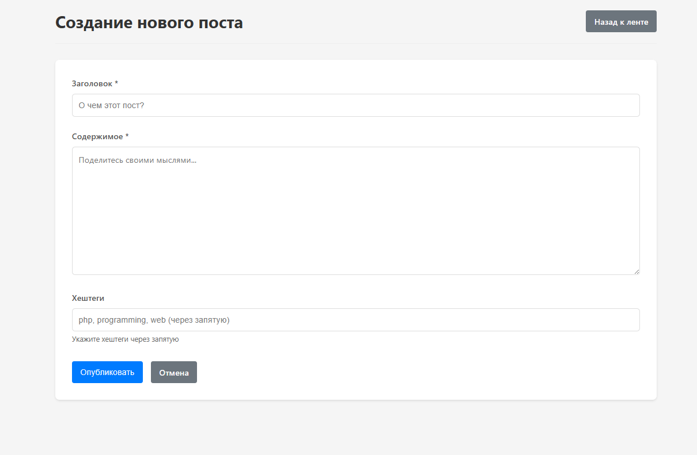
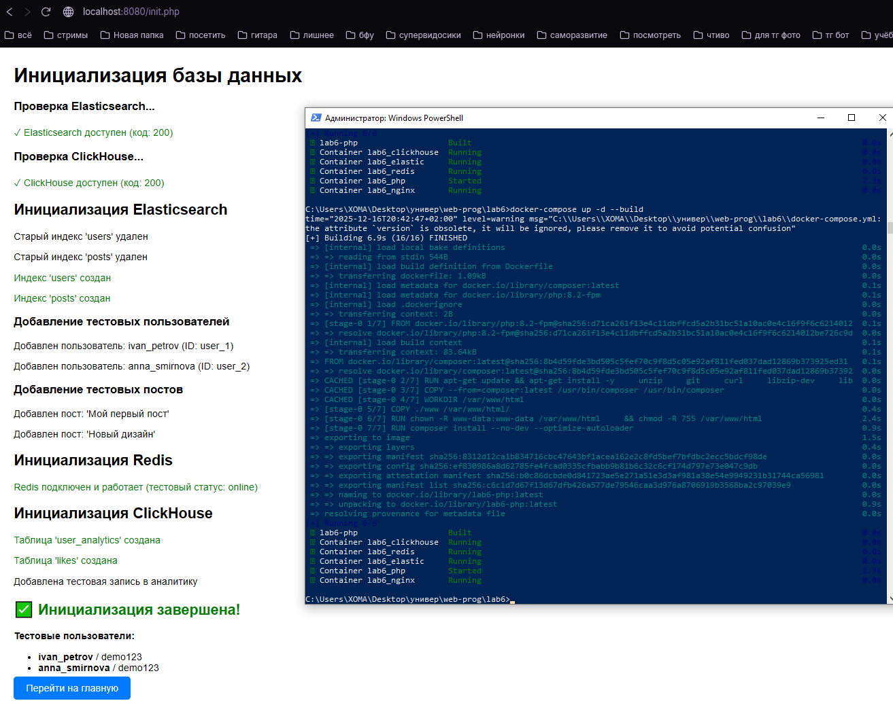

# Лабораторная работа №6: Нереляционные базы данных + Написание сайта
---
## Автор

Ус Владимир, 3МО-1

---
ТЗ: https://docs.google.com/document/d/1CjnI92sMiuCZ2yHSoxwI__8Br11fWy7yEdG7PcxRWyY/edit?tab=t.0
- Кратко: Изучение нереляционных баз данных (Redis, Elasticsearch, ClickHouse) и взаимодействие с ними через API с помощью GuzzleClient.
---

### Цели работы
---
- Настроить Redis, Elasticsearch, ClickHouse в Docker
- Освоить работу с NoSQL базами через HTTP API
- Реализовать взаимодействие с Elasticsearch для работы с новостями
- Закрепить навыки работы с Guzzle HTTP клиентом

### Итог
---
Создан сайт со следующими возможностями:

1. Главная страница\лента:

2. Страница регистрации:

3. Авторизация:

4. Профиль:

5. Написание поста:

5. Страница запуска сайта:

