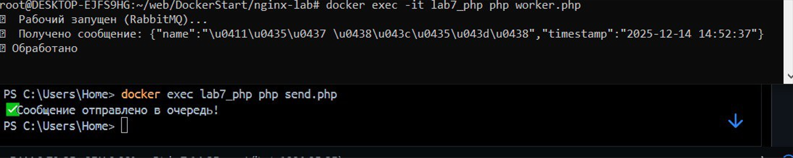

# Лабораторная работа №7: Асинхронная обработка данных через очереди сообщений
---
## Автор

Ус Владимир, 3МО-1

---
ТЗ: https://docs.google.com/document/d/1CjnI92sMiuCZ2yHSoxwI__8Br11fWy7yEdG7PcxRWyY/edit?tab=t.0
- Кратко: Реализация системы асинхронной обработки заявок на экскурсии с использованием RabbitMQ в качестве брокера сообщений. Все операции добавления и обработки заявок выполняются асинхронно через очередь сообщений.
---

### Цели работы
---
- Научиться работать с очередями сообщений и реализовывать асинхронную обработку данных в PHP.
- Познакомиться с интеграцией брокеров сообщений RabbitMQ через Docker.
- Научиться создавать producers (отправители) и consumers (обработчики) задач.

### Итог
---
1. RabbitMQ панель:

1. Добавление в очередь:

